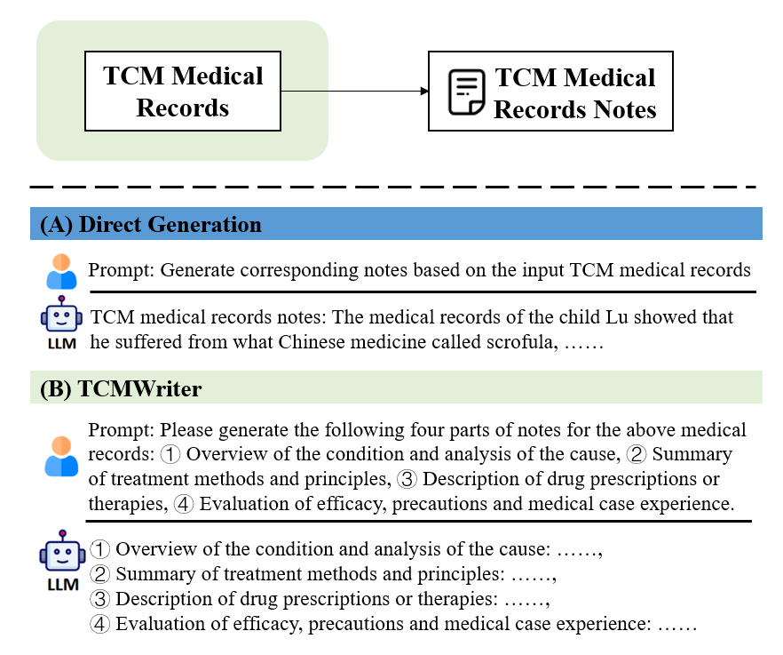
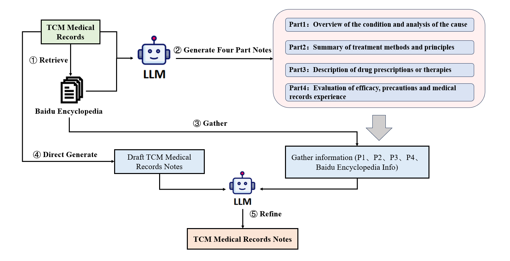

## TCMWriter: Controllable Notes Generation for Traditional Chinese Medicine Medical Records with Large Language Models

## Overview


<p align="center">
  
</p>

We explore writing TCM medical records notes from scratch. In this process, simple methods like direct prompting have limited generative power. In contrast, TCMWriter analyzes TCM medical records from four parts and different perspectives.

## How TCMWriter works

<p align="center">
  
</p>

Overview of TCMWriter, which can automatically generate TCM medical records notes. Starting from a given TCM medical records, TCMWriter collects various information covering the disease by searching Baidu Encyclopedia for related diseases. Then, it simulates the process of writing notes by old herbalist doctor to generate records notes from four parts and different perspectives based on the given TCM medical records notes and the collected information The final TCM medical records notes are generated based on the inherent knowledge of LLM and the information collected from Baidu Encyclopedia as well as medical records notes from four parts and different perspectives

## Installation

1. Clone the git repository.

   ```shell
   git clone https://github.com/Pdocw/TCMWriter.git
   cd TCMWriter
   ```

2. Install the required packages.

   ```shell
   conda create -n TCMWriter python=3.11
   conda activate TCMWriter
   pip install -r requirements.txt
   ```

## API

We suggest using `secrets.toml` to set up the API keys. Create a file `secrets.toml` under the root directory and add the following content:

```toml
OPENAI_API_KEY=""
OPENAI_API_TYPE=""
API_BASE=""
```

## Paper Experiments

The TCMMMR dataset used in our experiments can be found in [./TCMMMR](TCMMMR).

### TCMWriter

Run the following commands under [./src](./src).

```sh
nohup sh run.sh >> log/run.log 2>&1 &
```

### eval

Run the following commands under [./eval](./eval).

```sh
nohup sh eval.sh >> log/eval.log 2>&1 &
```

